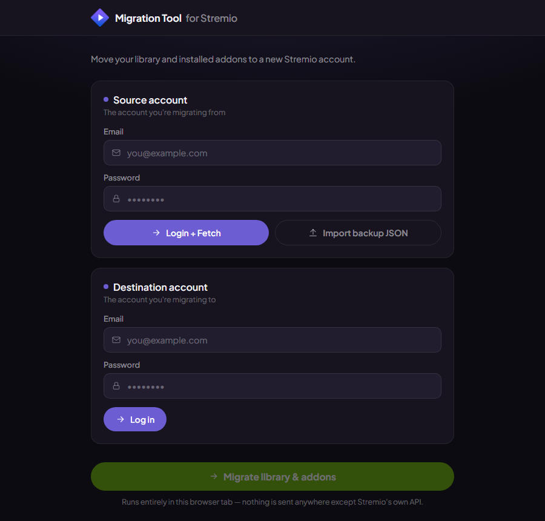
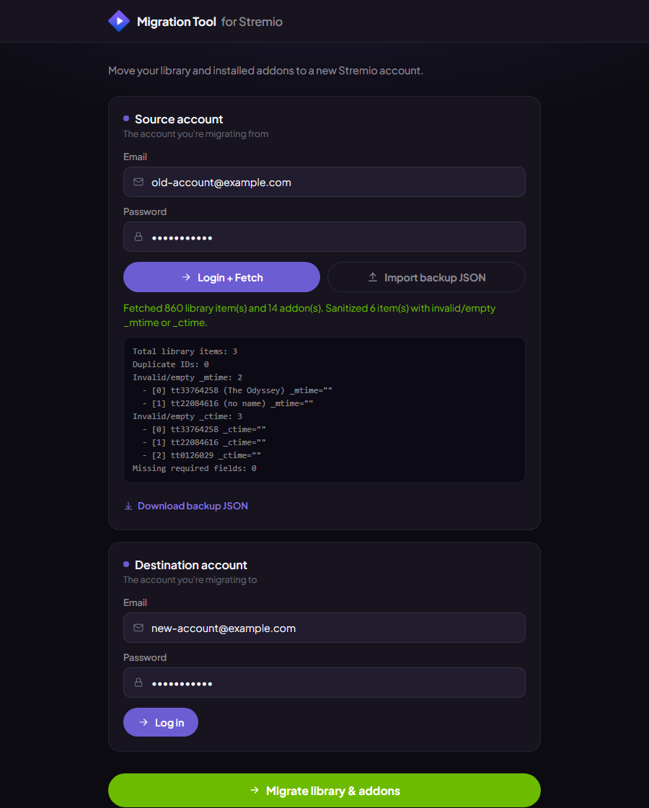

# Stremio Library & Addon Migration

Stremio doesn't let you change the email on an account. So if you ever need to move to a new one — new email, got locked out, whatever the reason — you're stuck manually re-adding every show and movie by hand. This is a small tool that copies your library and installed addons straight from one account into another.

## How it works

It's one file, `index.html`. No install, no build step, no server — open it in a browser and it talks directly to Stremio's own API. Nothing passes through a third party; your credentials and library data go from your browser to Stremio's servers and nowhere else, same as the official app.

## Using it

1. Open `index.html` in a browser.
2. Under **Source account**, log in with the account you're moving *from* and hit **Login + Fetch**. It pulls your library and addons, runs a quick sanity check on the data (more on that below), and gives you a "Download backup JSON" link — worth grabbing as a safety net. If you've already got a backup from a previous run, use **Import backup JSON** instead of logging in again.
3. Under **Destination account**, log in with the account you're moving *to*.
4. Click **Migrate library & addons**.

Running it more than once is safe — library items keep their original IDs, so migrating again overwrites rather than duplicating.

## Why there's a validation step

While putting this together, one of my library items turned out to have a corrupted `_mtime` field — an empty string instead of a real timestamp. Stremio's client can't parse that, and instead of just skipping the one bad item, it aborts loading the *entire* library and shows a "Library not loaded!" error, with a "premature end of input" message that doesn't point anywhere useful.

So now, every time the source library loads, the tool checks for duplicate IDs, missing fields, and bad or empty timestamps, and shows you a short report. Anything broken gets patched with a valid timestamp automatically, before it's ever sent anywhere.

## Notes

- Nothing is written to disk unless you click the backup download link yourself.
- This relies on Stremio's web API, which is stable in practice but not an officially documented public API — the same one the official apps use. If Stremio changes it, this may need an update.
